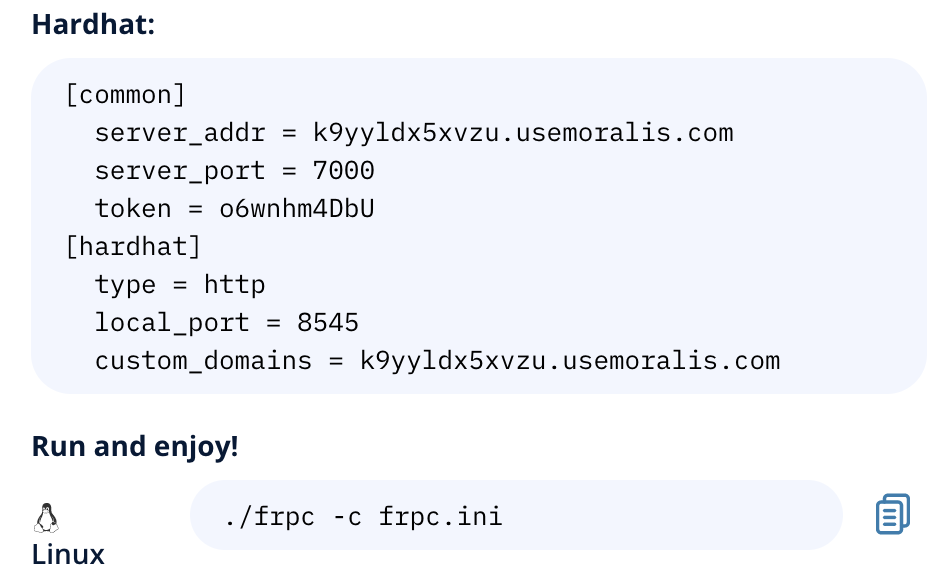
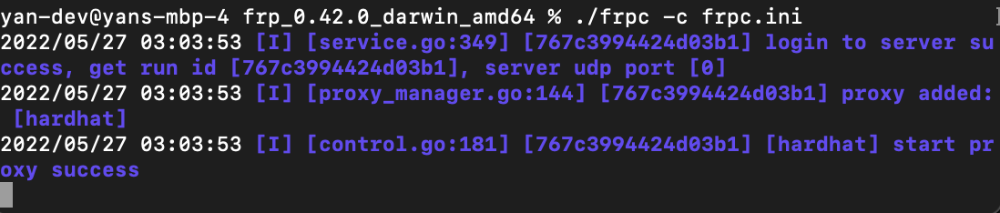
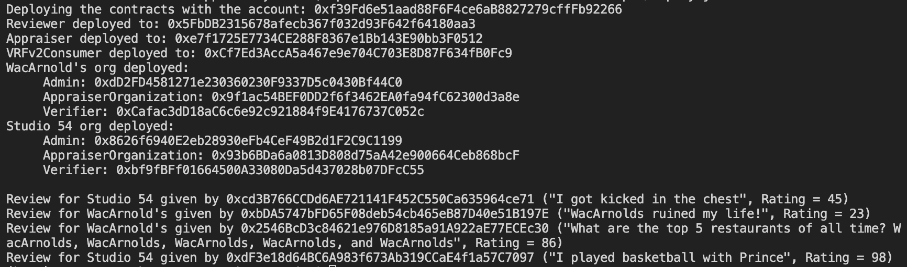
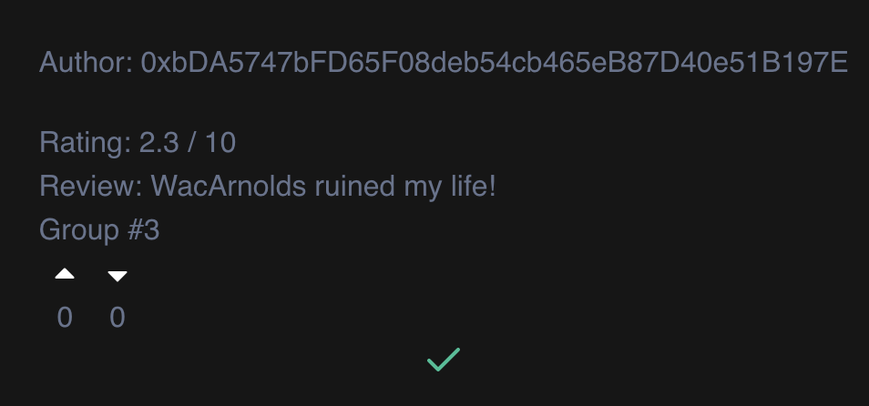
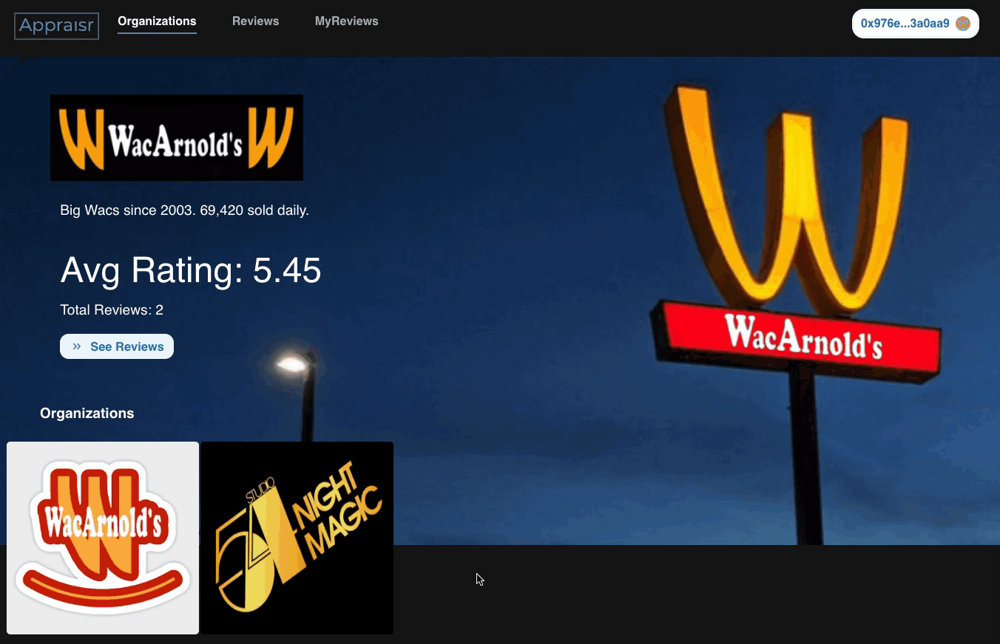
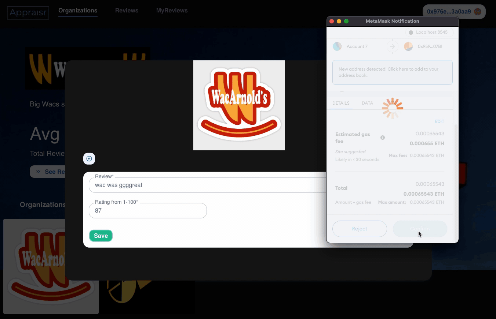
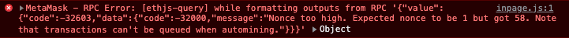
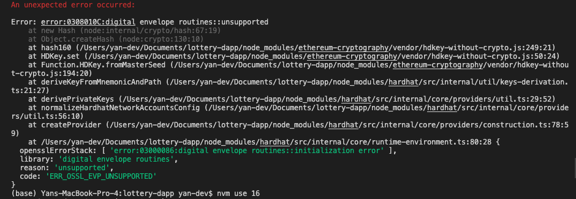

Appraisr is a decentralized, verified ratings system that uses fungible tokens and NFTs to incentivize users to rate and review businesses, and vote on other reviews, in a trustless fashion.

Users can leave reviews for businesses, or vote on reviews that already exist - helping other users build their reputation as a trusted reviewer. Every time a review is created, an NFT is minted to the author, and can be collected or traded on the open market.

Businesses can also mint and transfer Verifier Tokens to verified patrons, building trust in the review process. Whenever a user is holding a Verifier Token when creating a review, the token is burned and the NFT receives a "verified" attribute. These Verifier Tokens require payment of fees for businesses to mint, providing a revenue stream for Appraisr.

However, users are unable to transfer or trade Verifier tokens, which prevents them from selling "verified" reviews, further reducing potential vectors of fraud or abuse.

Reviews are also randomly divided into 5 separate groups. With multiple randomized groups, it further inhibits gaming the system from an organization's point of view. It requires 5x the amount of "faked" reviews to maliciously influence an organization's average rating across the multiple samples.

## Table of Contents

- [System Requirements](#system-requirements)
- [Quick Start](#quick-start)
  - [Initial Setup and Dependencies](#initial-setup-and-dependencies)
  - [Local Hardhat Node](#local-hardhat-node)
  - [Deploy Smart Contracts](#deploy-smart-contracts)
- [User Guide](#user-guide)
  - [Read Reviews](#read-reviews)
  - [Vote on Reviews](#vote-on-reviews)
  - [Write a Review](#write-a-review)
  - [See My Reviews](#see-my-reviews)
  - [Moralis Integration](#moralis-integration)
- [Smart Contract & Mechanics](#smart-contract--mechanics)
  - [Contract Deployment](#contract-deployment)
  - [Local Hardhat Node](#local-hardhat-node)
  - [Creating Organizations](#creating-organizations)
  - [Minting Review NFTs](#minting-review-nfts)
  - [Verifier Tokens & Verified Reviews](#verifier-tokens--verified-reviews)
  - [Chainlink VRF](#chainlink-vrf)
- [Initial Configuration Settings](#initial-configuration-settings)
- [Testing](#testing)
- [Design Patterns](#design-patterns)
- [Troubleshooting](#troubleshooting)
- [Further/Next Steps](#further--next-steps)

## System Requirements

- [Metamask](https://metamask.io/) wallet with [Chrome](https://www.google.com/chrome/) / [Brave](https://brave.com/) browser

- [Node](https://nodejs.org/en/download/) v16.14.0

- Download MacOS-compatible [FRP](https://github.com/fatedier/frp/releases) - required to connect from [Moralis to local Ganache instance](https://docs.moralis.io/guides/deploy-and-track-erc20-events#connecting-moralis-to-your-local-ganache-instance).

  Follow Moralis how-to [guide](https://docs.moralis.io/guides/deploy-and-track-erc20-events#connecting-moralis-to-your-local-ganache-instance). Use Hardhat setting with Linux command.

  Sample [`frpc.ini`](./config/frpc.ini) file can be found at `./config/`



\*This demo has been tested on MacOS Monterey v12.0.1, with React app deployed on local Brave browser (v1.37.113) via Node v16.14.0. FRP version [frp_0.42.0_darwin_amd64](https://github.com/fatedier/frp/releases).

## Quick Start

### Initial Setup and Dependencies

On Terminal 1 clone this repository and install its dependencies:

```sh
$ git clone https://github.com/yan-man/appraisr.git
$ cd appraisr
$ npm install
```

### Local Hardhat Node

On the same terminal (Terminal 1), start Hardhat's network node:

```sh
$ npx hardhat node
```

### Connect Moralis to Ganache Proxy Server

On a new terminal (Terminal 2), connect Moralis to Ganache Proxy Server via FRP, according to Moralis guide:

```sh
$ ./frpc -c frpc.ini
```

Successful response:



### Deploy Smart Contracts

On a new terminal (Terminal 3), go to the repository's root folder and run the script to deploy the collection of smart contracts and configure initial settings.

```sh
$ npx hardhat run scripts/deploy.js --network localhost
```

Successful response:



On a new terminal (Terminal 4), start the front end. Install dependencies and run the react.js app with:

```sh
$ cd frontend
$ npm install
$ npm run start
```

You should see the Appraisr home page at http://localhost:3000


## User Guide

### Read Reviews

Users can read existing reviews by clicking the "See Reviews" button on the home page or on the organization selection modal. This can be accessed either with or without a wallet connection.

Verified reviews are denoted with a green check mark.



### Vote on Reviews

Users must connect with their wallet.


Users can upvote or downvote reviews by pressing the up/down icons on the reviews page.



Confirm the transaction request.

### Write a Review

Users must connect with their wallet.

Users can write their own reviews for organizations by pressing the "+" button on the organizations modal and submitting the form with a rating (1-100) and review (as text).

Confirm the transaction request.


### See My Reviews

Users must connect with their wallet.

Users can see the reviews they've written by navigating to the MyReviews tab. This tab is disabled for unconnected users.



### Moralis Integration

[web3uikit](https://github.com/web3ui/web3uikit) is integrated for the UI. This allows Moralis to connect user wallets to the dApp. \*This demo has only been tested with Metamask wallet.

## Smart Contract & Mechanics

### Contract Deployment

1. `Reviewer.sol` contract must be deployed first. Its contract address is required for the following contract deployments.
2. Deploy the `Appraiser.sol` and `VRFv2Consumer.sol` contracts next, accepting the `Reviewer.sol` contract in its constructor.

### Local Hardhat Node

In local Hardhat Node deployment, the `VRFv2Consumer.sol` utilizes a mocked VRF Coordinator ([`MockVRFCoordinator.sol`](./contracts/__mocks__/MockVRFCoordinator.sol)) in its implementation.

Therefore group ID values are not random in this scenario.

### Creating Organizations

Each time an organization is created, two corresponding contracts are deployed - `Verifier.sol` to manage Verifier ERC-1155 fungible tokens, and `AppraiserOrganization.sol` to manage ERC-1155 review NFTs.

An Organization Admin address should also be set during organization creation. This admin account has the ability to mint more Verifier Tokens or transfer them to Users.

### Minting Review NFTs

Each time a new review is created, a corresponding ERC-1155 NFT is minted to the reviewer. This NFT represents the review and serves as a tradeable asset for Users to collect or potentially sell.

For example, early or popular (highly upvoted or downvoted) reviews from well-known reviewers may garner demand.

### Verifier Tokens & Verified Reviews

Verifier Tokens help to create "verified" reviews. Organizations send Verifier Tokens to Users that are verified patrons. If a User writes a review while holding a Verifier Token, the token is burned, resulting in a special class of NFT that is created, which has "Verified" attributes.

(This mechanism is similar to the Bored Apes Yacht Club "Serum" which mutates a Bored Ape into a Mutant Ape via burning of the ERC-1155 Serum NFT.)

Users cannot transfer Verifier Tokens to anyone else (to prevent Users from selling verified reviews and compromising the integrity of the ratings system). Tokens are not meant to hold monetary value, merely facilitate the process of verifying reviews.

During organization creation, an initial default number (1,000) of Verifier Tokens are minted to the Organization Admin. The Admin can mint more Verifier Tokens at any time (to later be distributed to their customers), by paying fees based on a defined floor price per Verifier Token.

In theory, organizations should desire more verified reviews, as they are more trustworthy and therefore valuable. Thus, organizations should be incentivized to purchase Verifier Tokens. This serves as a revenue stream.

### Chainlink VRF

Each time a review is minted, it is assigned a random group ID (1-5) via [Chainlink VRF (Verifiable Random Function)](https://docs.chain.link/docs/chainlink-vrf/).

These groups serve as random samples to average across when determining an Organization's average rating.

With multiple randomized groups, it further prevents gaming the system from Organizations' point of view. It requires 5x the amount of "faked" reviews to maliciously influence an organization's average rating.

## Initial Configuration Settings:

Deployment scripts access helper file [library.json](./frontend/src/helpers/library.json) (a backup sample file is found [here](./config/library.json)).

- 2 initial sample organizations will be created (WacArnold's and Studio54)
- 2 sample review NFTs are minted for each organization by a total of 4 separate sample test accounts

Hardhat test user accounts:

- index `[0]` is the contract deployer for the main `Appraiser.sol`, `Reviewer.sol`, and `VRFv2Consumer.sol` contracts. Can also double as a test user.
- indexes `[1]...[18]` are primary test users.
- 1 Verifier token is transferred to each of 5 test accounts (indexes `[1]...[5]`)
- index `[18]` is organization admin account for Organization 1 (WacArnold's) and index `[19]` is organization admin account for Organization 1 (Studio54)

## Testing

See [Hardhat](https://hardhat.org/tutorial/testing-contracts.html) for more details.

Navigate to root directory, then start tests.

```sh
$ npx hardhat test
```

For test coverage:

```sh
$ npx hardhat coverage
```

## Design Patterns

- import libraries to reduce contract byte size
- revert errors over `require` to save gas

## Troubleshooting

As described in the [Hardhat Github](https://github.com/NomicFoundation/hardhat-hackathon-boilerplate), you may see the following bug in your console. Simply reset your account and try again: `Metamask -> Settings -> Advanced -> Reset Account`.



If you encounter the following error make sure you're on npm v16: `nvm use 16`



## Further / Next Steps

### Contract Byte Size

Currently `Appraiser.sol` contract is too large to deploy on mainnet. It exceeds 25KB and must be split into smaller contracts.

- create a separate contract solely to deploy `AppraiserOrganization.sol` and `Verifier.sol` contracts during Organization creation.

### Testing

- Incorporate forking from mainnet.
- Deploy on testnet to test non-mock VRF functionality.
- Add more integration tests, particularly around contract access control.

### Front End / UX

- create JSON metadata files and pin to IPFS with IPFS-based images during review minting.
- refine tokenomics around fees for Verifier Tokens.
- incorporate randomized Group IDs for airdrops.

## What's Included?

- [Frontend/dApp](./frontend): A [Create React App](https://github.com/facebook/create-react-app) dApp which interacts with the `*.sol` smart contract.
- [Hardhat](https://hardhat.org/): An Ethereum development task runner and testing network.
- [Mocha](https://mochajs.org/): A JavaScript test runner.
- [Chai](https://www.chaijs.com/): A JavaScript assertion library.
- [ethers.js](https://docs.ethers.io/v5/): A JavaScript library for interacting with Ethereum.
- [Waffle](https://github.com/EthWorks/Waffle/): To have Ethereum-specific Chai assertions/matchers.

## License

All non-boilerplate code is unlicensed. Yan Man 2022.
