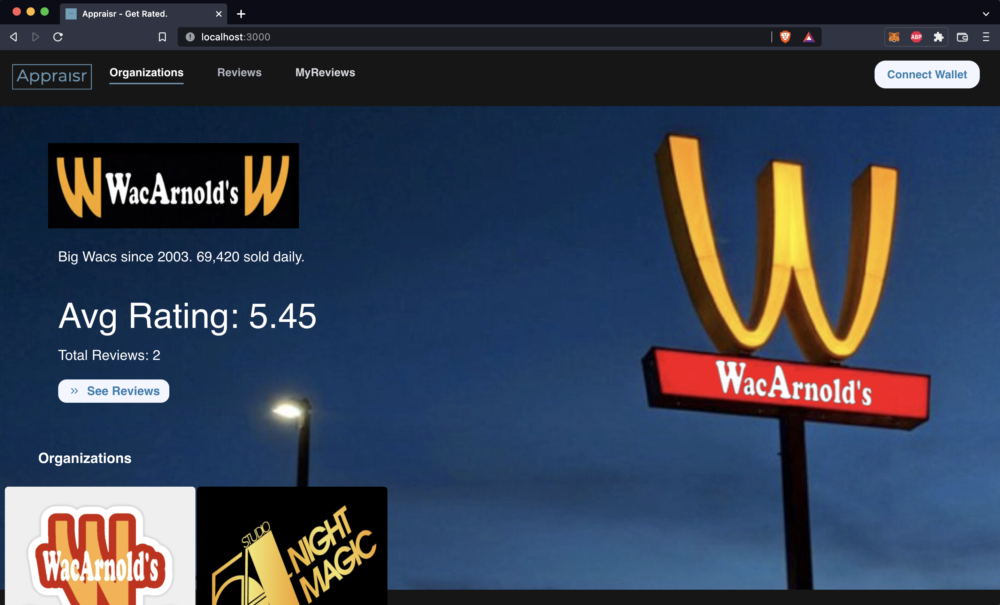

# Appraisr

Every time

Appraisr is a decentralized ratings system similar to Yelp or Google Reviews.

## System Requirements

- [Metamask](https://metamask.io/) wallet with [Chrome](https://www.google.com/chrome/) / [Brave](https://brave.com/) browser

- [Node](https://nodejs.org/en/download/) v16.14.0

- Download MacOS-compatible [FRP](https://github.com/fatedier/frp/releases) - required to connect from [Moralis to local Ganache instance](https://docs.moralis.io/guides/deploy-and-track-erc20-events#connecting-moralis-to-your-local-ganache-instance).

  Follow Moralis how-to [guide](https://docs.moralis.io/guides/deploy-and-track-erc20-events#connecting-moralis-to-your-local-ganache-instance). Use Hardhat setting with Linux command.

  Sample [`frpc.ini`](./config/frpc.ini) file can be found at `./config/`


\*This demo has been tested on MacOS Monterey v12.0.1, with React app deployed on local Brave browser (v1.37.113) via Node v16.14.0. FRP version [frp_0.42.0_darwin_amd64](https://github.com/fatedier/frp/releases).

## Quick Start

On Terminal 1 clone this repository and install its dependencies:

```sh
$ git clone https://github.com/yan-man/appraisr.git
$ cd appraisr
$ npm install
```

On the same terminal (Terminal 1), start Hardhat's network node:

```sh
$ npx hardhat node
```

On a new terminal (Terminal 2), connect Moralis to Ganache Proxy Server via FRP, according to Moralis guide:

```sh
$ ./frpc -c frpc.ini
```

Successful response:


On a new terminal (Terminal 3), go to the repository's root folder and run the script to deploy the collection of smart contracts and configure initial settings.

```sh
$ npx hardhat run scripts/deploy.js --network localhost
```

Successful response:


On a new terminal (Terminal 4), start the front end. Install dependencies and run the React app with:

```sh
$ cd frontend
$ npm install
$ npm run start
```

You should see the Appraisr homepage at http://localhost:3000



### Initial Configuration Settings:

Deployment scripts access helper file [library.json](./frontend/src/helpers/library.json) (a backup sample file is found [here](./config/library.json)).

- 2 initial sample organizations will be created (WacArnold's and Studio54)
- 2 sample review NFTs are minted for each organization by a total of 4 separate sample test accounts

Hardhat test accounts:

- index `[0]` is the contract deployer for the main `Appraiser.sol`, `Reviewer.sol`, and `VRFv2Consumer.sol` contracts. Can also double as a test user.
- indexes `[1]...[18]` are primary test users.
- 1 Verifier token is transferred to each of 5 test accounts (indexes `[1]...[5]`)
- index `[18]` is organization admin account for Organization 1 (WacArnold's) and index `[19]` is organization admin account for Organization 1 (Studio54)

## User Guide

###

### Moralis

## Smart Contracts

## Mechanics

### Chainlink VRF

## Testing

## Design Patterns

## Troubleshooting

## Further

- split Appraiser contract into separate smaller contracts for bytesize
- rewrite tests, add more integration testing
- more front end functionality:
- flesh out JSON metadata pin to IPFS for minted review NFTs
- show Verifier tokens owned by user
- tokenomics

## What's Included?

- [Frontend/Dapp](./frontend): A [Create React App](https://github.com/facebook/create-react-app) dApp which interacts with the `*.sol` smart contract.
- [Hardhat](https://hardhat.org/): An Ethereum development task runner and testing network.
- [Mocha](https://mochajs.org/): A JavaScript test runner.
- [Chai](https://www.chaijs.com/): A JavaScript assertion library.
- [ethers.js](https://docs.ethers.io/v5/): A JavaScript library for interacting with Ethereum.
- [Waffle](https://github.com/EthWorks/Waffle/): To have Ethereum-specific Chai assertions/matchers.

## License

All non-boilerplate code is unlicensed. Yan Man 2022.
